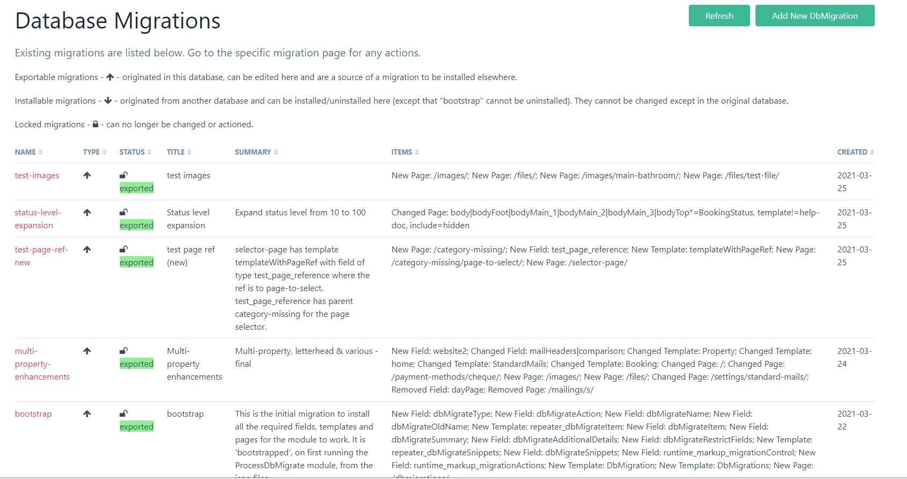
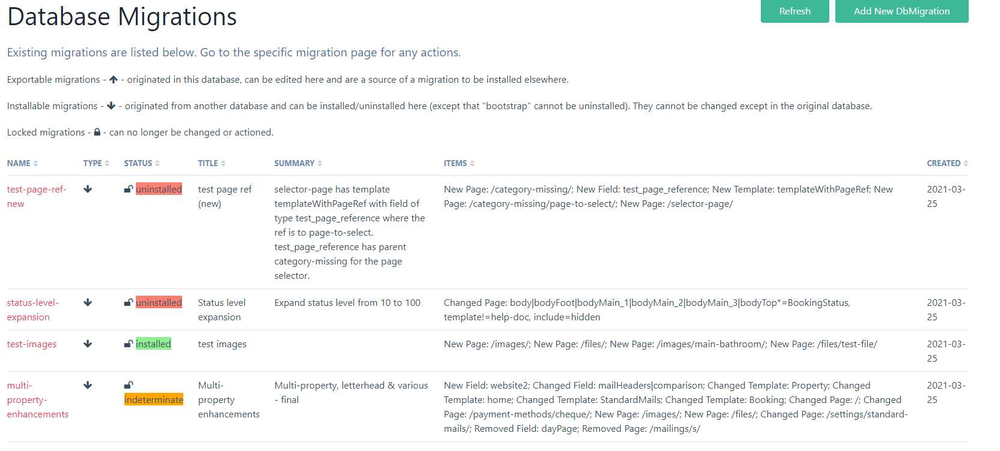
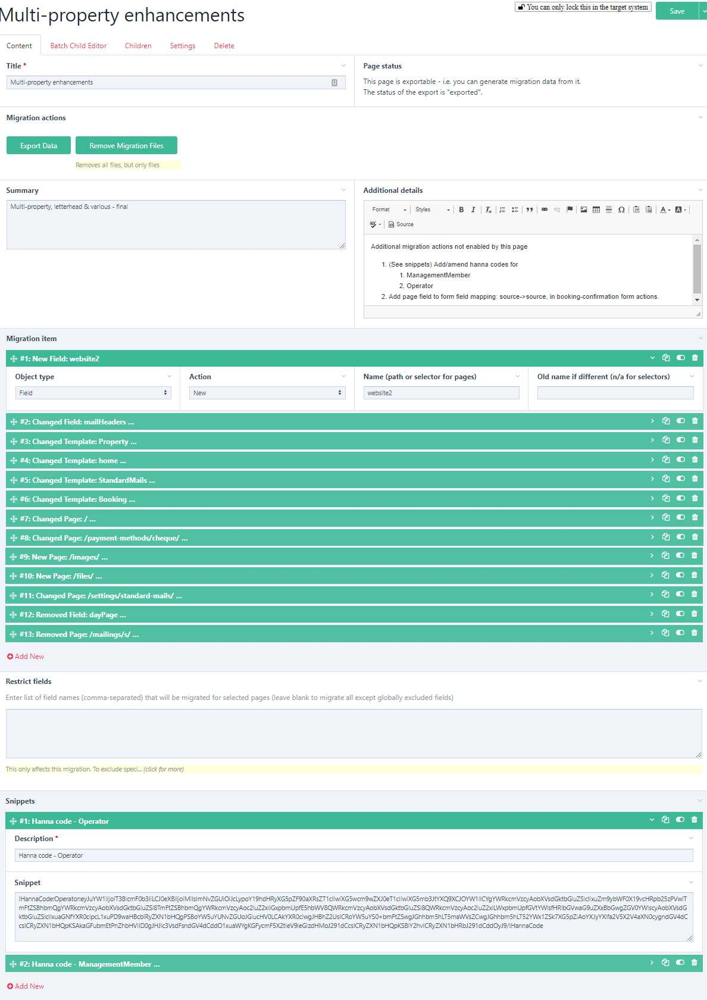
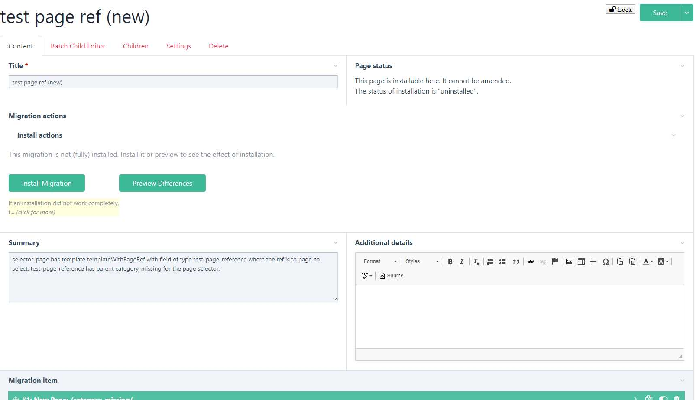
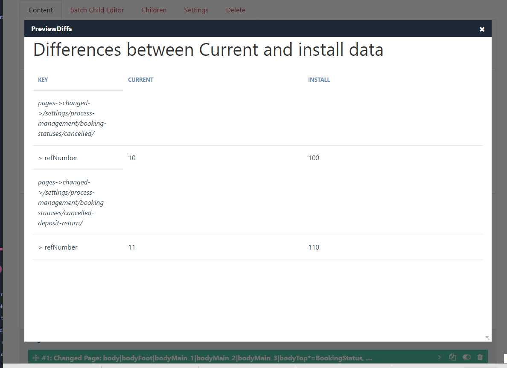

# DB Migrations module

This module was designed to make the process of updating the system as quick and error-free as possible.

## Concept

Two migration modules already existed in ProcessWire, but neither suited my needs:

- &quot;Migrations&quot; seems effective but quite onerous to use and has been deprecated in favour of &quot;RockMigrations&quot;
- RockMigrations is simpler and has a nice declarative method: migrate(). However, it is ideally suited to &quot;headless&quot; development, where the API is used in preference to the Admin UI. This is great for professional PW developers, but for occasional developers like me, it is much easier to use the UI rather than just the API.

The concept of this module is therefore to achieve the following:

1. To allow development to take place (in a separate environment on a copy of the live database, or on a test database with the same structure) using the Admin UI. When finished, to permit a declarative approach to defining the migration and implementing it (again in the UI).
2. To allow testing of the migration in a test environment on a copy of the live database.
3. To allow roll-back of a migration if installation causes problems (ideally while testing rather than after implementation!).
4. To provide a record of changes applied.
5. Optionally, if changes are made directly on the live system (presumably simple, low-risk mods – although not best practice), to allow reverse migration to the development system in a similar fashion.
6. Although not originally intended, the module also allows the selective reversion of parts of the database by exporting migration data from a backup copy.

## Design

The module has the following principal components:

- A PW module &quot;ProcessDbMigrate&quot;, bundled with a bootstrap migration in the same ProcessDbMigrate folder, to be placed in the site/modules folder;
- A Page Class &quot;DbMigrationPage&quot;;
- A folder &quot;RuntimeOnly&quot; containing php files dbMigrateActions.php and dbMigrateControl.php along with javascript files dbMigrateActions.js and dbMigrateControl.js.

The module requires the FieldtypeRuntimeOnly module.

Migration definitions are held in .json files in the templates/DbMigrate /migrations/{migration name} folder. This folder contains up to 2 sub-folders - &quot;new&quot; and &quot;old&quot; which each may contain a file called a migration.json file, which defines the scope of the migration, and - once the migration been exported (for &#39;new&#39;) or installed (for &#39;old&#39;) – a file called data.json. The latter file contains the data comprising the installation (or uninstallation, in the case of the &#39;old&#39; file). There may also be a file lockfile.txt if the migration has been locked, which just holds a date &amp; time stamp of when it was locked.

The migration files described above are mirrored by pages of template &quot;DbMigration&quot; under a parent /dbmigrations/ of template &quot;DbMigrations&quot;. The mirroring happens in two ways:

1. If a new migration is created in the module (from the Setup -> Database Migration menu – see below re installation), then initially no json files exist. The json files are created in the new directory, after the scope of the migration is defined on the page, by running &quot;Export Data&quot; from the eponymous button.
2. If (new) json files exist, but there is no matching migration page, then the latter is created by the module on accessing the Database Migration admin page. In this case, we are in the &quot;target&quot; database so there is no &quot;Export Data&quot; button, but instead &quot;Install&quot; and/or &quot;Uninstall&quot; buttons.

Migrations therefore either view the current environment as a &quot;source&quot; or a &quot;target&quot;. This is determined by whether the meta item meta(&#39;installable&#39;) is set or not. 
 (The terms ‘installable’ and ‘exportable’ are used in this help file to differentiate the two types). 
Thus, if required, a knowledgeable superuser can change the type of a migration by adding or removing this meta item (e.g. in the Tracy console), but this is deliberately not made easy.
(See further notes below on source and target databases).

## Health warnings

This module alters files and database elements. It is intended for superuser use only. Always take a backup before using it.

## Installation

Initially install the module in your dev (source) environment.

1. Place the whole folder in your site/modules/ directory.
2. Make sure that the RuntimeOnly module is installed first. Install ProcessDbMigrate (see note below re dependencies).
3. Installing the module runs a &#39;bootstrap&#39; migration which creates (system) templates called DbMigration and DbMigrations and a page in the admin named &#39;dbmigrations&#39;, so make sure you are not using those already and rename if required. It also creates some fields which include &quot;dbMigrate&quot; in their name. All templates and fields have the &#39;dbMigrate&#39; tag. The bootstrap migration files are copied by the installation process to the templates/DbMigrate directory, which will be created if it does not exist. Also, the RuntimeOnly files are copied to the /templates/RuntimeOnly/ directory.
4. Configure the settings. Note that the settings are specific to the current database. You can give the (current) database a name. If you do so, this name will be included as a tag (‘sourceDb’) in the migration.json of any migration you create from this database. Any database with the same name will treat this migration as exportable rather than installable. This means, for example, that you can copy a production database and rename it to be the same as your original development database, so that any migrations sourced from that development database will be shown as exportable, not installable. You can also request that the current database name is notified in every admin page (in case you forget which environment you are in!).
   
   Also in the settings, you can exclude any fields or fieldtypes from page migrations that might cause problems and which are not needed. RuntimeMarkup and RuntimeOnly fields are excluded automatically (you will need to do this in each database).
5. Open the admin page &quot;Setup -> Database Migration&quot; to create your first migration. You will see that one (&quot;bootstrap&quot; is already installed) and cannot be modified (unless you unset the meta(&#39;installable&#39;)).

### Dependencies

Note that this module has only been tested on ProcessWire>=3.0.148 and requires the RuntimeOnly module to run.

## Upgrading

Place the code in the modules directory, replacing the existing files, then refresh modules in the database.

## Uninstalling

Uninstalling the module first uninstalls the bootstrap migration. If that fails then the error will be reported, so that it can be fixed, and the module will not be uninstalled.

## Overview

The pic below illustrates the DB Migrations page in the source environment.

The status of a migration (as a source page) can be &#39;pending&#39; or &#39;exported&#39;. &#39;Pending&#39; means either that the migration data have not yet been exported or that the current export files differ from the source database.

To test your migration, one approach is to backup the dev database and restore a copy of the live (or test) database to the dev environment. Then install the module on the restored database (from step 2 above). On installation of the module, if the required database elements for the module (e.g. DbMigration template) are not present, a bootstrap method is called which creates them, according to the definition in ProcessDbMigrate/migrations/bootstrap. Then the admin page &quot;Database Migrations&quot; with process ProcessDbMigrateData is created at setup/dbmigrations. On opening this page, the individual Migration pages (type 2) are created from the definitions in their respective /new/migration.json file.

Your new migration should be listed (as &#39;indeterminate&#39; status) in the Database Migration admin page.

To install on the live (or a separate test) environment, sync your source and target code environments. Then install the module in your target environment (from step 2).

The pic below illustrates the Database Migrations page in the target environment.

In a target environment, a migration status can usually be &#39;indeterminate&#39;, &#39;installed&#39; or &#39;uninstalled&#39;. &#39;Indeterminate&#39; means either that the migration has not yet been installed (so no &#39;old&#39; files containing the uninstall definition exist yet) or that the current state matches neither the &#39;new&#39; or the &#39;old&#39; state. &#39;Installed&#39; means that the current state matches the &#39;new&#39; definition and &#39;uninstalled&#39; means that it matches the &#39;old&#39; definition (i.e. it has been actively uninstalled rather than not yet installed). There is also a &#39;void&#39; status which indicates that the migration achieves nothing.

**Note** : If you can&#39;t remember whether you are working in a source or target environment (important! - you don&#39;t want to make developments in a test environment and then lose them!), just visit the DB Migrations page.

## Usage

When carrying out development work, keep a note of what fields, templates and pages you have added, changed or removed. The module does not track this for you – it is a declarative approach, not a macro recorder. Also (in version 0.0.1), it does not handle other components such as Hanna codes and Formbuilder forms. These come equipped with their own export/import functions, so use those.

You can update a migration page as you go along, rather than keep a separate note of changed components. The migration page also allows you to document the migration using a rich text box and also to add any number of &quot;snippets&quot;. These snippets do not do anything, but can be a convenient place to store (for example) Hanna code exports for pasting into the target environment and they help to make the page a comprehensive record of the migration.

See example below:

On your migration page, enter the names of new and changed fields and templates, and enter the paths of pages (as /path/to/pagename/ ). Note that entry of names and paths is in text fields, not using dropdowns as names, paths and ids may be different in the source and target systems – there is limited real-time checking of these. If an item has a different name in the target system then provide it in the &#39;old name&#39; box, otherwise leave that blank.

Note that **the sequence is very important** – if items are dependent on other items, they must be declared in the correct order for installation (when uninstalling, the order is reversed and &#39;new&#39; and &#39;removed&#39; are swapped). Note particularly for Repeater and PageTable field types, you need to define the components in the right order – e.g. the template before the field that uses it, in the case of new/changed components. You do not need to declare components that are unchanged.

_Selectors_: Only one item is permitted per entry, however pages may be selected by using a selector rather than individual path names. Selectors operate as follows:

1. For &#39;new&#39; and &#39;changed&#39; pages, the selector identifies the pages in the **source environment only**. If these pages also exist in the target environment, they will be changed, otherwise they will be created. There is no possibility of matching pages whose path name has changed.
2. For &#39;removed&#39; pages, the selector identifies pages in the **target environment only**.

So do make sure that your selector works in the source and/or target environments, as appropriate, before implementing it.

Pages may have the scope of changes limited by restricting the fields to those specified in the &quot;Restrict Fields&quot; box. This restriction will apply to all pages selected but only in this migration; if you wish to exclude certain fields or fieldtypes globally, enter these in the module configuration.

You can preview the changes at any time, even before you export them, this will help you ensure that the data you are proposing to migrate is correct. You can also test as you go along, if you wish, and add to the migration in stages.

Note that migration pages just define the scope of the migration. It is entirely feasible for other parts of the dev database to be changed which are outside this scope and which will therefore not be migrated. If you are doing this intentionally, be extremely careful to ensure that the scope of your migrations do not overlap, otherwise you may inadvertently make changes that you do not wish to do yet.

The system will warn you, when saving a migration page in the source database, if the current migration scope overlaps with other exportable migrations. **Do not proceed to install such overlapping migrations**. They will interfere with each other, even if they are not making conflicting changes – once one has been installed, installing the other will create an &#39;old&#39; json file that reflects changes made by the first, so (for example) attempting to uninstall this second installation will appear not to be successful as it will not be able uninstall the changes made by the first. If two migrations necessarily overlap, then the correct process is to install the first one and lock it before installing the second migration. Locking a migration is carried out in the source environment. This creates a lockfile in the migrations directory which needs to be sync&#39;d to the target environment to lock the migration there.

In addition, warnings will be given if you attempt to install &#39;new&#39; pages that already exist.

If you want to modify the bootstrap, you may need to remove the meta(&#39;installable&#39;) setting in the development environment – you can then modify the Migration template etc. (assuming you know what you are doing!). However, note that the original bootstrap files in the module directory will be unchanged by this. Also, reinstalling the module may over-write your changed bootstrap.

When ready to test (or migrate to live), click the &quot;Export Data&quot; button on the migration page. Some informative messages should result. Your codebase will now contain the json files in site/templates/DbMigrate/migration/{your migration page name} – you can inspect them if you wish in your IDE.

Sync code and go to your test/live environment (or restore the test database to your dev environment, making sure you back up the dev database first), install the module as described above, if necessary, and go to the Database Migration admin page. You should see your new migration listed.

Go to the migration page. Before installing you can use the &quot;preview&quot; button to see what changes will be implemented. If you are happy, click &quot;Install&quot;. This should result in various messages and maybe some errors, if the migration was not able to complete fully (see section below for how to deal with partial migrations). See example of the migration page in &#39;installation&#39; mode below:

and an example preview:

Note that you will now have the following files:

- A folder &quot;old&quot; in site/templates/DbMigrate/migration/{your migration page name} – this contains (as file data.json) the definition of the database (within the migration scope) before the migration was installed and is used for roll-back. It also has the migration page definition that was used for the installation (as /old/migration.json) – this is used to detect whether the migration scope definition has changed since installation. The &#39;old&#39; folder is used for uninstalling. If the migration scope is changed (in the source environment) then it cannot be installed in the target environment without first uninstalling the previous version of the migration scope and then installing the new version – in this way the &#39;old&#39; files will reflect the revised scope.
- A folder site/assets/cache/dbMigrations has the json files defining the current state of the database (within the scope of the migration)

To uninstall a migration, click the &quot;Uninstall&quot; button (again, you can preview beforehand). This should revert the database to the initial state, but again there may be reasons why this cannot complete fully – see the notes below.

NB When re-installing and un-re-installing migrations, issues may arise with the &#39;old&#39; files being wrong unless you &#39;remove migration files&#39; before exporting a new version.

### Troubleshooting / Technical notes

#### Issues with page migrations
Issues may arise with page migration which are not possible to foresee fully. This is particularly the case if the user migrates pages with multiple complex field types and custom processing. The module was designed for migrating developments, not for mass updating of user pages. It is therefore assumed that any pages being migrated are of a ‘site-settings’ nature, not user pages. That said, it is possible to use the module more generally (e.g. in ‘rescue’ mode) but test carefully first.
In particular, the host PW application may make use of page hooks. All page actions in the module allow hooks to run. To enable users to modify this behaviour, session variables are set for the duration of the following methods:
- installPages() – new/changed pages – ‘installPages’ is set to true
- removeItems() – all item removals – ‘removeItems’ is set to true

These can then be referenced in the application code as required.

#### Partial / Unsuccessful migrations

In some circumstances, migrations may not complete properly. This will result in error messages when the migration is installed. Some typical examples and possible solutions are set out below. Occasionally, re-clicking &#39;install&#39; or &#39;uninstall&#39; may resolve this. Note that you cannot change a migration definition in the target environment, so any changes need to be done in the source environment and re-exported (and installed after uninstalling the previous version).

_Fields not fully installed_: This may be because there are fieldtypes which cannot currently be handled by the module. It could also be caused by dependencies on pages (e.g. for page reference fields) where the pages have not been included in the migration ahead of the field.

_Templates not fully installed_: You may not have included new fields, used by a template, within your migration page scope, ahead of including the template. You will need to go back to the dev system and do this (re-export and re-install)

_Pages not fully installed_: This may be because you have not previously defined new templates or fields used by a page, in which case you will need to go back to the dev system and do this (re-export and re-install). It might also be because certain fieldtypes cannot be sync&#39;d but do not need to be and should be excluded. To exclude field types from the pages scope, go to the module config page. If there are field types that do not sync correctly, but which you do not wish to exclude, then you will need to update the target system manually (the preview should give you the details).

_Components not removed_: This is most likely because you have misnamed the component or because it does not exist in the target database. Double check the naming and go back to the dev system to change as required.

Use the preview button to see what changes have not been fully implemented. You can also inspect and compare the json files to identify the issue (your IDE is probably the best place to do this). For example, compare templates/…/new/data.json (the required state) with assets/cache/dbMigrations/new-data.json (the current state). (Similarly, for uninstallation problems, compare ../old/data.json with assets/cache/dbMigrations/old-data.json).

#### Field types

The module handles (I think) the following field types:

- Core fieldtypes: These have not all been tested, but most are straightforward.
- Select Page has been tested and should work – however there may be problems if a parent page name/path has changed, in which case the migration might need to be split into two successive installations.
- FieldtypeRepeater: This is more complicated because the field is actually linked to a template and multiple repeater pages.
   When defining a migration, the normal sequence is to define fields before templates which might use them. However, repeater fields are linked to their own templates, so the repeater\_fieldName template needs to be included before fieldName.
- FieldtypePageTable: This has a PageArray so requires special processing.
- FieldtypeStreetAddress. This is an object, and requires special processing analagous to PageTable.
- Images and files. 
Similarly to the above, these are more complex fields. 
Some special processing is required to deal with the likely differences between host page ids meaning that urls and paths will differ between the source and target environments.
Images should be migrated along with the page that holds them. Any Rich Text Editor (textarea) fields with embedded images should migrate satisfactorily **provided** the pages which hold the images are included in the migration.

#### Subsequent installations

After an initial export from a source and installation in a target, the question arises as to how to deal with revised or additional migrations. If a migration is revised in the source, then it can be installed in the target once the previous version has been uninstalled. New migrations exported from the source are handled in the same way as initial migrations (except that the module is already installed in the target).

However, the user may wish to use a (migrated) test or live database as a new source for subsequent development (assuming the migrations so far are bug-free). In this case, use one (or both) of the following strategies:

- Use database naming (in the module settings page) to rename the imported database back to the name you were using for the development database.
- Lock the completed migrations (by clicking on the &#39;lock&#39; icon on the migration page) before importing the database. They will then be there as a record only – the database can be copied to the development environment (after locking) and new migrations can be developed for export, knowing that the base system is in sync (except for user changes to the live system, which will normally only be to pages, not fields or templates). 

The use of names for items (including the new|old syntax) rather than ids should mean that most user changes will not disrupt future migrations. Installation &#39;previews&#39; should highlight any difficulties. Overlapping scope detection on migrations only looks at unlocked migrations.

It is also possible, in theory (not advised, but maybe necessary if the development environment is inaccessible) to make changes directly to the live database and &#39;export&#39; them for installation on the development system. These should be locked after installing them.
Database naming is strongly recommended if you use this strategy.

#### Rescue mode

An additional use of the module is &#39;rescue&#39; mode. If a number of erroneous changes have occurred to a live database which need to be reverted, then a suitable backup copy can be restored to the development environment (after backing up the dev database!) and the relevant migration exported for installation in the live environment. After successful installation, the development database can be restored to the development environment – the &#39;rescue&#39; migration will then be loaded automatically as a (&#39;installable&#39; – i.e. non-editable or exportable) migration and can be installed if it makes sense to do so.