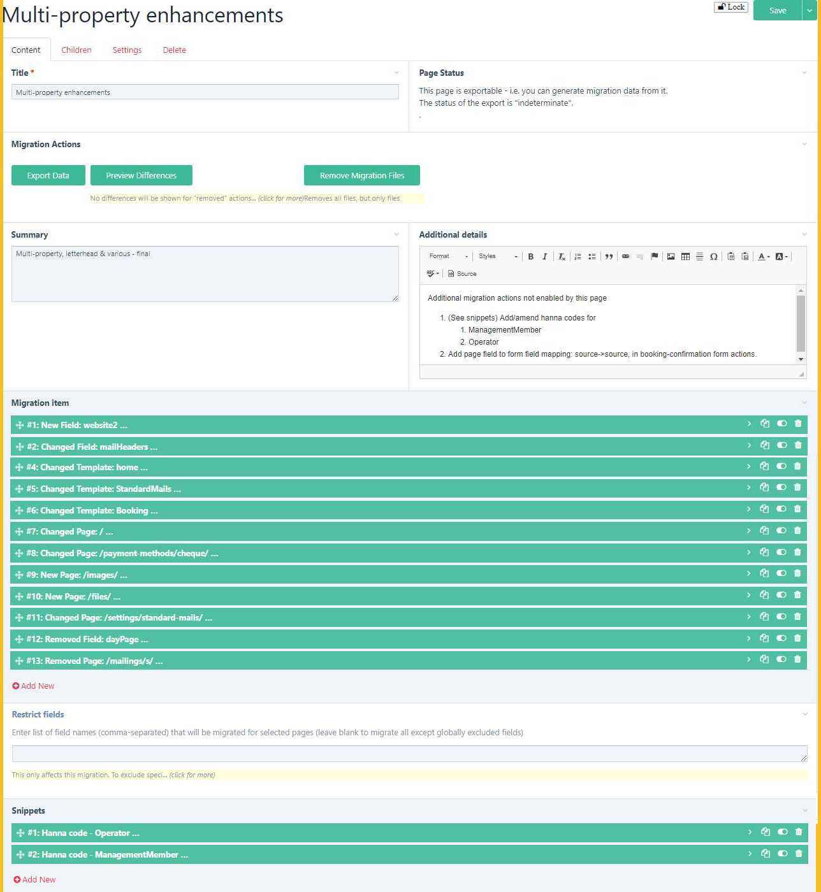

# DB Migrations module
<!-- NB Technical comments are included as HTML comments so that they do not display in the normal view. -->

<!-- Export to HTML (with styles) for inclusion in site. The Typora export adds a spurious </div> after the <div style="display:none"> tag at the end of the user-visible section. This needs to be removed after each export -->

## Contents

[toc]

## Introduction

ProcessWire is an outstanding content management system/framework owing to its flexibility, ease of use and outstanding API. However, it suffers from a common problem in database-oriented CMSs in that business logic may be explicitly or implicitly stored in the database rather than in code. This is particularly the case where it is used for a full-blooded app rather than just a simple CMS for a website. This is a shame because it is such a brilliant app-building tool.

The problem arises where the developer wishes to develop and test new or changed features in a development/test environment and then port those to the live environment. If the business logic is purely in the code and there are no database changes, then no issue arises, but if the changes involve database changes then typically the solution might be to test them, then replicate them manually (and hopefully accurately) in the live system. For large changes, this can be time-consuming and possibly error-prone. If a test environment is used as well as a development and live environment, then the problem is doubled.

The ProcessDbMigrate module is designed to make updating the test and/or live system as quick and error-free as possible.

## Concept

Purely code-based migration approaches effectively eschew the use of PW’s GUI development environment. This is technically perfectly sensible but restricts usage to those who are happy not to use the GUI. PW is a great tool for enabling less experienced developers to build great apps. This module is aimed at that group, who wish to use the PW GUI but still be able to do controlled and accurate migrations.

The concept of this module is therefore to achieve the following:


1.	To allow development to take place (in a separate environment on a copy of the live database, or on a test database with the same structure) using the Admin UI. When finished, to permit a declarative approach to defining the migration and implementing it (again in the UI).
2.	To allow testing of the migration in a test environment on a copy of the live database.
3.	To allow roll-back of a migration if installation causes problems (ideally while testing rather than after implementation!).
4.	To provide a record of changes applied.
5.	Optionally, if changes are made directly on the live system (presumably simple, low-risk mods – although not best practice), to allow reverse migration to the development system in a similar fashion.
6.	To provide a database comparison tool which can (if wished) be used to create a draft migration for the differences between the databases.

## Uses

The module has quite a wide range of applications. The original intention was just to handle the first of the examples below, but it has actually proved more useful than intended!
1.	Developments where database changes are involved (as well as possibly code changes). The changes can be fully tested in a dev environment. Installation of the migration can then easily be checked in a test environment (on a copy of the live database). Installation in the live environment is then very quick (sync code changes and migration files then one click to install the migration) resulting in little or no down time.
2.	Updating of admin pages (not editable by general users), such as settings pages and help pages in the dev environment, then installing as a batch.
3.	Updating of language pages (e.g. by a simple migration of pages with 'template=language') – the associated files will be updated along with the pages.
4.	The selective reversion of parts of the database (by exporting migration data from a backup copy) for example where users have created numerous errors in the database.
5.	Comparison of two databases (within a defined scope of fields, templates and pages) and optional creation of migration to align them. 
6.	Creation of a ‘blank canvas’ database from an existing working version. In other words, migrate the structure and all the necessary settings pages to a clean database.

## Design

The module has the following principal components all within the ProcessDbMigrate folder:

-	A PW module “ProcessDbMigrate” - the main autoload module which also provides the setup pages;
-	A Page Class “DbMigrationPage” - the class for the DbMigration template which defines the migration pages;
-	A bootstrap migration;
-	A Page Class “DbComparisonPage” which extends DbMigrationPage (see separate section on comparisons for further information about this);
-	A folder “RuntimeFields” containing php files dbMigrateActions.php, dbMigrateControl.php and dbMigrateReady.php along with javascript files dbMigrateActions.js, dbMigrateControl.js and dbMigrateReady.js. These runtime fields are used in migration pages to display status and provide controls;
-	A module FieldtypeDbMigrateRuntime to implement the above runtime fields (pre v0.1.0 versions required the FieldtypeRuntimeOnly module).

Migration definitions are held in .json files in the site/templates/DbMigrate /migrations/{migration name} directory. This directory contains up to 3 sub-directories - “new”, “old”  and “archive”. The first two each may contain a file called a migration.json file, which defines the scope of the migration, and - once the migration been exported (for ‘new’) or installed (for ‘old’) – a file called data.json. The data.json file contains the data specifying the details of the installation (or uninstallation, in the case of the ‘old’ file). In addition, the “new” and “old” directories can contain “files” directories which hold the files associated with pages in the migration. The “old” directory may also contain an “orig-new-data.json” file for comparison purposes. The “archive” directory contains earlier versions of the “old” directory if migration definitions have changed. There may also be a file ‘lockfile.txt’ if the migration has been locked, which just holds a date & time stamp of when it was locked.

The migration files described above are mirrored by pages of template &quot;DbMigration&quot; under a parent /{admin name/dbmigrations/ of template &quot;DbMigrations&quot;. The mirroring happens in two ways:

1. If a new migration is created in the module (from the Setup -> Database Migration menu – see below re installation), then initially no json files exist. The json files are created in the "new" directory, after the scope of the migration is defined on the page, by running &quot;Export Data&quot; from the eponymous button.
2. If (new) json files exist, but there is no matching migration page, then a page is created by the module on accessing the Database Migration admin setup page. In this case, we are in the &quot;target&quot; database so there is no &quot;Export Data&quot; button, but instead &quot;Install&quot; and/or &quot;Uninstall&quot; buttons.

Migrations therefore either view the current database environment as a “source” or a “target”. This is determined by whether the $page->meta(‘installable’) for the page is set or not. (The terms ‘installable’ and ‘exportable’ are used in this help file to differentiate the two types). Thus, if required, a knowledgeable superuser can change the type of a migration by adding or removing this meta item (e.g. in the Tracy console), but this is deliberately not made easy. (See further notes below on source and target databases).

Migration items may be either fields, templates or pages. <!--As regards the API used for this, for fields, I am using a heavily modified copy of ProcessFieldExportImport::processImport() (although that has problems with options fields which I have had to fix), for templates, I call ProcessTemplatesExportImport::setImportData() and am just using the standard API for pages (there are ProcessPagesExportImport and PagesExportImport classes in the core, but these appear to be unfinished.-->


## Health warnings

This module alters files and database elements. It is intended for superuser use only. **Always take a backup before installing, updating or uninstalling it. Also take a backup before installing or uninstalling any migration.**

**Use at your own risk and test before implementing on the live system. Always have the same version of the module in source and target databases.**

## Installation

Initially install the module in your dev (source) environment.

1.	Place the whole folder in your site/modules/ directory.
2.	Install ProcessDbMigrate.
3.	Installing the module runs a ‘bootstrap’ migration which creates (system) templates called DbMigration, DbComparison and DbMigrations and parent pages in the admin named ‘dbmigrations’ and ‘dbcomparisons’, so make sure you are not using those already and rename if required. It also creates some (system) fields which include “dbMigrate” in their name. All templates and fields have the ‘dbMigrate’ tag and are set as ‘system’ (i.e. flags=8) so they do not muddy the standard menus. The bootstrap migration files are copied by the installation process to the site/templates/DbMigrate directory, which will be created if it does not exist.
4.	Configure the settings. Note that the settings are specific to the current database. 
   - *Database name*: You can give the (current) database a name – in fact this is strongly recommended. If you do so, this name will be included as an item (‘sourceDb’) in the migration.json of any migration you create from this database. Any database with the same name will treat this migration as exportable rather than installable. This means, for example, that you can copy a production database and rename it to be the same as your original development database, so that any migrations sourced from that development database will be shown as exportable, not installable. 
   - *Show database name in notice*: The current database name is notified (as a PW message) in every admin page (in case you forget which environment you are in!) – this will only be shown to superusers or users with the admin-dbMigrate permission.
   - *Exclude field types, fields, attributes*: You can exclude any fields or fieldtypes from page migrations that might cause problems and which are not needed (you will need to do this in each database). DbMigrateRuntime, RuntimeMarkup and RuntimeOnly fields are always excluded and do not need to be specified here. Similarly, you can exclude attributes from field and template migrations.
   - *Auto-install bootstrap*: If selected (the default), the bootstrap will be automatically installed on an upgrade.
   - *Prevent conflicting page saves*: It is strongly recommended that you do not make any direct changes in the target database to any objects which are the subject of a current (unlocked) migration as this can cause problems if you need to uninstall the migration (the stored original state will not reflect the changes you made). This option (selected by default) prevents any such page changes in the target which may otherwise happen inadvertantly. Field and template changes are not prevented, but inadvertant changes to these are less likely.
5.	Open the admin page “Setup -> Database Migration” to create your first migration. You will see that one (“bootstrap”) is already installed and cannot be modified (unless you unset the meta(‘installable’) - see [Amending the Bootstrap](#amending-the-bootstrap)).

### Dependencies

Note that this module has only been tested on ProcessWire>=3.0.148. A minimum of 3.0.165 is recommended.

## Upgrading

Place the code in the modules directory, replacing the existing files, then refresh modules in the database. Check whether the bootstrap is still showing as ‘installed’. It should have been installed automatically; if not, then install it.

If you are upgrading from a version earlier than 0.1.0, then the RuntimeOnly module will no longer be required for this module so, unless you use it elsewhere, you can uninstall it after the upgrade.

## Uninstalling

Before uninstalling the module, all migration pages (other than the bootstrap) must be removed manually. Then, uninstalling the module uninstalls the bootstrap migration automatically; if that fails then the error will be reported, so that it can be fixed manually, before attempting to uninstall again.

## Overview

The pic below illustrates the DB Migrations page in the 'source' environment.


The status of a migration (as a source page) can be &#39;pending&#39; or &#39;exported&#39;. &#39;Pending&#39; means either that the migration data have not yet been exported or that the current export files differ from the source database.

To install on the live (or a separate test) environment, sync your source and target code environments. Then install the module in your target environment (from step 2 above). After installation of the module, on opening the admin page &quot;Database Migrations", the individual Migration pages are created from the definitions in their respective /new/migration.json file.

If you do not have a separate test environment, one approach is to backup the dev database and restore a copy of the live (or test) database to the dev environment. Then install the module on the restored database (from step 2). However, a separate test environment is better in that it more accurately mimics the live one and is less likely to cause confusion.

Your new migration should be listed (as &#39;indeterminate&#39; status) in the Database Migration admin page.

The pic below illustrates the Database Migrations page in the target environment.


In a target environment, a migration status can usually be &#39;indeterminate&#39;, &#39;installed&#39; or &#39;uninstalled&#39;. &#39;Indeterminate&#39; means either that the migration has not yet been installed (so no &#39;old&#39; files containing the uninstall definition exist yet) or that the current state matches neither the &#39;new&#39; or the &#39;old&#39; state. 'Installed' means that the current state matches the &#39;new&#39; definition and &#39;uninstalled&#39; means that it matches the &#39;old&#39; definition (i.e. it has been actively uninstalled rather than not yet installed). There is also a &#39;void&#39; status which indicates that the migration achieves nothing.

**Note** : If you can&#39;t remember whether you are working in a source or target environment (important! - you don&#39;t want to make developments in a test environment and then lose them!), make sure all databases have names in the module config and select “Show database name in notice”.

## Usage

TLDR: 

-	Install the module in each database environment and enter the settings - give the databases different and meaningful names
-	Specify your migration in the source database and “export” it
-	Sync your code environments
-	Install the migration in your target environment


### Documenting the migration

When carrying out development work, keep a note of what fields, templates and pages you have added, changed or removed. The module does not track this for you – it is a declarative approach, not a macro recorder. Also, it does not handle other components such as Hanna codes and Formbuilder forms. These come equipped with their own export/import functions, so use those (see "Snippets").

The best way to document the changes is to create and update a migration page as you go along, rather than keep a separate note of changed components. The migration page also allows you to document the migration using a rich text box, and it is recommended that you use this to add notes about the migration, including any pre- or post-migration checks and procedures to be carried out. (You may carry out some procedures automatically – see the section on hooks).

### Snippets

On the migration page, you can  add any number of &quot;snippets&quot;. These snippets do not do anything, but can be a convenient place to store (for example) Hanna code exports for pasting into the target environment and they help to make the page a comprehensive record of the migration.

You can also use snippets for php code to run before or after installation (or uninstallation). The code can then be copied into Tracy’s console log and run from there. Use the description box in the snippet to indicate when the code should be run. For example, say you have changed an address field to split out the post code into a separate field. The migration definition will specify the new field and the changed template. The code snippet (to be run after installation) will then include the code to extract postcodes and place them in the new field.

Alternatively, if you want code to run automatically, you can use hooks – see the separate section on this.

### Populating the migration page

See example below:



On your migration page, enter the names of new and changed fields and templates, and enter the paths of pages (as /path/to/pagename/). Selectors may be used instead of paths or names (see box below). Note that entry of names and paths is in text fields, not using dropdowns, as names, paths and ids may be different in the source and target systems – there is limited real-time checking of these. If an item has a different name in the target database then provide it in the &#39;old name&#39; box, otherwise leave that blank.

Note that **the sequence is very important** – if items are dependent on other items, they must be declared in the correct order for installation (when uninstalling, the order is automatically reversed and &#39;new&#39; and &#39;removed&#39; are swapped). Note particularly for Repeater and PageTable field types, you need to define the components in the right order – e.g. the template before the field that uses it, in the case of new/changed components. You do not need to declare components that are unchanged.

---
***Selectors***: 

*Only one object name is permitted per item, however objects may be selected by using a selector rather than individual names or paths. Selectors operate as follows:*

1.	*For ‘new’ and ‘changed’ objects, the selector identifies the objects in the* ***source environment only***. *If these objects also exist in the target environment, they will be changed, otherwise they will be created (but avoid ambiguity – see 4 below). There is no possibility of matching objects whose name (or path) has changed.*
2.	*For ‘removed’ objects, the selector identifies objects in the **target environment only**.* 
3.	*The use of “sort=path” is permitted in page selectors, even though this normally has no effect. If it is used, the pages will be sorted in parent-child order, using the ‘natural’ sort order (e.g. XYZ100 is greater than XYZ20). This means that parents will be installed before children. For ‘removed’ pages, the order is automatically reversed so that children are deleted before parents (there is no need to use the inverse: sort=-path).*
4.	***Important***: *Make sure that the scope of a selector works in both the source and target environments, i.e.:* 
* *a.	If the action is ‘changed’ then it must be unambiguous – i.e. all the names/paths of the selection of objects must be the same in both environments. Do not use ‘changed’ with an ambiguous selector because, although it may appear to install correctly, it will not be possible to uninstall it - any moved or removed pages will not be removed and uninstallation will fail.*
* *b.	If the action is ‘new’ then the selection of objects should only exist in the source environment;*
* *c.	If the action is ‘removed’ then the selection of objects must only exist in the target environment.*

*Do make sure that your selector works in the source and/or target environments, as appropriate, before implementing it (TracyDebugger is great for this).*
***A typical error is forgetting to add “include=…”.***

***Note*** *that if your selectors encompass a large number of objects, processing time may be extended.*


---

You can limit the scope of changes to pages by <u>restricting</u> the fields to those specified in the &quot;Restrict Fields&quot; box. This restriction will apply to all pages within the scope of this migration, but only this migration; if you wish to <u>exclude</u> certain fields or fieldtypes globally, enter these in the module configuration.

You can preview the changes at any time, even before you export them, this will help you ensure that the data you are proposing to migrate is correct. You can also test as you go along, if you wish, and add to the migration in stages.

Note that migration pages just define the scope of the migration. It is entirely feasible for other parts of the dev database to be changed which are outside this scope and which will therefore not be migrated. If you are doing this intentionally, be careful to ensure that the scope of your migrations do not overlap, otherwise you may inadvertently make changes that you do not wish to do yet.

When saving a migration page in the source database, the system will warn you if the current migration scope overlaps with other exportable migrations. **Do not proceed to install such overlapping migrations**. They will interfere with each other, even if they are not making conflicting changes – once one has been installed, installing the other will create an ‘old’ json file that reflects changes made by the first, so (for example) attempting to uninstall this second installation will appear not to be successful as it will not be able uninstall the changes made by the first. If two migrations necessarily overlap, then the correct process is to install the first one and lock it before installing the second migration. Locking a migration is carried out in the source database. This creates a lockfile in the migration's directory which needs to be sync’d to the target environment to lock the migration there.

### Exporting the migration

When ready to test (or migrate to live), click the &quot;Export Data&quot; button on the migration page. Some informative messages should result. Your codebase will now contain the json files in site/templates/DbMigrate/migration/{your migration page name} – you can inspect them if you wish in your IDE.

Sync the code files with your test/live environment (or restore the test database to your dev environment, *making sure you back up the dev database first*). In the test/live database, install the module as described above, if necessary, and go to the Database Migration admin page. You should see your new migration listed.

### Installing the migration

Go to the migration page. Before installing, you can use the &quot;preview&quot; button to see what changes will be implemented. If you are happy, click &quot;Install&quot;. This should result in various messages and maybe some errors, if the migration was not able to complete fully (see section below for how to deal with partial migrations). See example of the migration page in &#39;installation&#39; mode below:


and an example preview:


Note that you will now have the following files:

- A folder “old” in site/templates/DbMigrate/migration/{your migration page name} – this contains (as file data.json) the definition of the database (within the migration scope) before the migration was installed and is used for roll-back (uninstall). It also has the migration page definition that was used for the installation (as /old/migration.json) and the data.json file that was used (as old/orig-new-data.json) – these are used to detect whether the migration scope definition has changed since installation. The ‘old’ folder is used for uninstalling. If the migration scope is changed (in the source environment) then it cannot be installed in the target environment without first uninstalling the previous version of the migration scope and then installing the new version – in this way the ‘old’ files will reflect the revised scope.
- A folder site/assets/cache/dbMigrations has the json files defining the current state of the database (within the scope of the migration)

To uninstall a migration, click the &quot;Uninstall&quot; button (again, you can preview beforehand). This should revert the database to the initial state, but again there may be reasons why this cannot complete fully – see the notes below.

NB When re-installing migrations, if the migration definition has changed, the system will require you to uninstall first - otherwise the “old” data.json will not properly reflect the new scope, affecting any future uninstallation. In these circumstances, a backup copy of the “old” directory is created in the archive directory.

### Database comparisons
Comparisons work in a similar way to migrations. First, make sure you are in the database which you wish to be the ‘source’ of the comparison (usually the development database – this will be assumed for the rest of this narrative). Also, make sure that your database is named (on the module settings page). 

On the Database Migrations page, select the “Add New DbComparison” button. On the DbComparison page you can add a summary and a number of ‘comparison items’. Note that comparison items just comprise an object type (field/template/page) and a name/selector. These items define the scope of the comparison. In theory, you can compare entire databases by using a selector “id>0” for each of pages, fields and templates. However, this is likely to be quite resource-hungry if the database is large, so it is better to use a scope that is more selective. In any case, you will probably want to exclude migration and database comparisons from the scope, together with the related repeater pages, otherwise it can be a bit self-referential (but shouldn’t crash). The example below compares all templates and fields (but not pages):


After saving the page, click ‘export data’ (or preview first) and sync the templates/DbMigrate/Comparison/{name}/ directory to your target environment. Then go to the target database and open the comparison page (you may need to refresh the comparisons summary page first). Here you will see two ‘migrate actions’: 

- click ‘Compare Database’ to see the differences between the current database and the source; 
- click ‘Create a Draft Migration For This Comparison’ to do exactly that (see below).

#### Creating a migration from a comparison

This process is only semi-automated. The system will work out the scope of the required migration (i.e. what fields, templates and pages require adding/changing/removing) but will not identify any dependencies, so the sequence of migration items might be wrong. Also, it will not identify any name changes – if names are different then this will result in a ‘new’ and a ‘removed’ item.

Therefore, clicking the ‘create draft migration’ button does only create a draft. You need to 

- sync the migration files to the source environment;
- review the migration page in the source database, resequencing the items as necessary. 
- For name changes, you can alter the ‘new’ item to be ‘changed’ and set the ‘old name’ to be the name of the ‘removed’ item; then delete the removed item (although the migration should still work without doing this, it is neater). 
- then export the migration from the source environment and install it in the usual way.

If you have selected the whole database for comparison, then rather than create a migration, you are probably better just to do a backup and restore 😉.

_Subsequent migrations_: 
Up until the point when migration created from a comparison has a /new/data.json file exported from the source system, it is considered to be ‘draft’ (signified by a meta(‘draft’) element). While in this draft state, it is replaced by any new draft migration created from the same comparison. After it is no longer draft, creating a draft migration from a comparison will result in a new draft migration, leaving the original in place. In this way, a comparison page can be left in place and used to create multiple migrations over time (provided, of course, that any new changes to the data are exported from the comparison page in the source database and sync’d to the target).

### Hooks

#### Available hooks
Many of the ProcessDbMigrate methods are hookable:
-	___execute() – Display the Database Migrations setup page
-	___newPage($template, $parent, $title, $values) – Create new migration or comparison (depending on $template)
-	___executeGetMigrations() – refreshes all migration pages
-	___exportData($migrationPage) – creates the .json files for a migration
-	___removeFiles($migrationPage, $oldOnly=false) – removes the .json files for a migration or comparison ($oldOnly=true will only remove the /old/ directory)
-	___installMigration($migrationPage) – installs a migration in the target
-	___uninstallMigration ($migrationPage) - uninstalls a migration in the target
-	___lockMigration($migrationPage, $migrationFolder) – locks a migration (in the source)
-	___unlockMigration($migrationPage, $migrationFolder) – unlocks a migration (in the source)
-	___previewDiffs($migrationPage, $comparisonType) – previews migration changes where $comparisonType is one of: export, install, uninstall, review

#### Placement

You can place your hooks in site/ready.php. In this case you will need to check the name of the migration page before running – e.g.

````
wire()->addHookAfter('ProcessDbMigrate::installMigration', function ($event) {
    $migrationPage = $event->arguments(0);
    if ($migrationPage->name == 'my-migration') {
        ///code to run
    }
});
````

and then you use $migrationPage to further reference the migration page. This approach keeps all your hooks together and you have to remember to sync the site/ready.php as well as your migration files.

Alternatively (**the recommended approach**), you can place a file called ready.php in the site/template/DbMigrate/migrations/{my-migration}/ directory, in which case your script would be

````
$this->addHookAfter('ProcessDbMigrate::installMigration', function ($event) {
// code to run
});
````

and you can use $this to reference the migration page. This approach keeps all your migration-related data & code together and you only have to sync the migration folder. It also means that your migration-specific ready.php code will be displayed at the bottom of the migration page.  Also, if you ‘remove migration files’ it will remove your custom code as well (usually you will only be doing this as preparation to delete the migration, so that is what you want). With the first approach, your hook will remain in site/ready.php.

#### Usage
Of the available hooks, installMigration and uninstallMigration are likely to be the most useful. For example, a hook after ProcessDbMigrate::installMigration could be used to carry out database-wide changes following the amendment of the structure. Using the example given under ‘Snippets’ earlier, say you have changed an address field to split out the post code into a separate field. The migration definition will specify the new field and the changed template. The hook could then include the code to extract postcodes and place them in the new field.  You could place code to undo this as a hook before ProcessDbMigrate::uninstallMigration, so that executing the uninstall exactly reverses the install.

In some circumstances you may not wish the code in your hook to run if (for example) the installation was not completely successful. You can test the status of a migration as follows (*use $migrationPage = $event->arguments(0); instead of $this if your code is in site/ready.php*):
-	Test if $this->meta(‘installedStatus’)[‘status’] is ‘installed’ or ‘uninstalled’. This yields the installed status before the (un)installMigration method, regardless of whether the hook is before or after.
-	For ‘after’ hooks, update the status by calling $this->refresh() before testing the status to get the status after running the (un)installMigration method.

Note that $this->meta(‘installedStatus’) is an array as follows:

·     'status' => (string) one of *pending* (not yet exported or different from exported data), *exported*, *indeterminate* (not installed or uninstalled – usually means not yet installed and no ‘old’ files yet exist to provide uninstall data), *installed*, *uninstalled*, *superseded* (locked migration which would otherwise be shown as pending or indeterminate), *void* (installed and uninstalled),

·     'scopeChange' => *true* if the proposed migration and old/orig-new-data.json reference different database elements (so the ‘old’ definition would no longer be a suitable basis for an uninstall action)**,

·     ‘scopeDiffs’ => the differences between the new and previous migration, where there is a scope change

·     'installed' => *true* if installedData and installedMigration are true,

·     'uninstalled' => *true* if uninstalledData and uninstalledMigration are true,

·     'installedData' => *true* if installedDataDiffs is empty,

·     'uninstalledData' => *true* if uninstalledDataDiffs is empty,

·     'installedDataDiffs' => (array) reportable* differences between the current state and the installation data (new/data.json),

·     'uninstalledDataDiffs' => (array) reportable* differences between the current state and the uninstallation data (old/data.json),

·     'installedMigration' => *true* if installedMigrationDiffs is empty,

·     'installedMigrationDiffs' => (array) reportable* differences between the current migration definition and the installation migration definition (new/migration.json),

·     'uninstalledMigration' => *true* if uninstalledMigrationDiffs is empty,

·     'uninstalledMigrationDiffs' => (array) reportable* differences between the current migration definition and the uninstallation migration definition (old/migration.json) – it will be empty if the migration has not yet been installed and so no ‘old’ files yet exist,

·     'uninstalledMigrationKey' => *true* if uninstalledMigrationKeyDiffs is empty,

·     'uninstalledMigrationKeyDiffs' => (array) any 'key' differences between the current and uninstallation migration definitions; 'key' differences are those which affect the database (migration items and 'restrict fields')

·     'reviewedDataDiffs' => (array) reportable* differences between the installation data (new/data.json) and the uninstallation data (old/data.json) – it will be empty if the migration has not yet been installed and so no ‘old’ files yet exist,

·     ‘timestamp’ => just that – the time the installedStatus meta was created

*Reportable differences exclude any differences in excluded fields and also any differences that are purely caused by pages having different ids in the source and target databases. The array is multidimensional of varying depths with the bottom elements being 2-element arrays containing the differing values.

**Note that it is perfectly possible for there to be a scope change even if there are no differences in the migration definition. For example, if a page selector is used and changes to the source database mean that there is a change in the pages found by the selector.

Use the Tracy console - *d($page->meta('installedStatus'));* - to inspect the installed status for any migration page. Call the method exportData() - *$page->exportData('compare');* - first to update the meta if required.

## Troubleshooting / Technical notes

#### Guide to the files

The following files are created:
1.	Migrations files (template/DbMigrate/migrations) hold all details of migrations in directories named after the migration name. The bootstrap migration is created on installation. 
2.	Within each migration directory, the following may be found:
a.	A ‘new’ directory which holds the exported details of a migration. This contains migration.json (the definition of the scope of the migration, derived from the source migration page), data.json (the definition of all the elements within the scope, derived from the source database) and a 'files' directory containing directories for any files/images associated with migrated pages. To install a migration in a target environment, this ‘new’ directory needs to be copied there (in its parent migration directory).
b.	An ‘old’ directory (created on installation of a migration in the target environment). This has a similar structure to ‘new’. Note that the migration.json file is a copy of the file that scoped the installation. The data.json file defines the pre-installation state as a ‘reverse migration’ (i.e. it reverses the actions of the data.json file that was used for the installation). The orig-new-data.json file stores a copy of the new/data.json file that was used to install the migration and create this old directory – it is used to check for scope changes. Note that subsequent installations do not change this directory unless the scope of the migration has been changed and the old installation is uninstalled (see c below).
c.	An archive directory holding previous ‘old’ directories when migrations have changed.
d.	A ready.php file if the user created it.
e.	A lock file – lockfile.txt – if the migration is locked.
3.	Temporary files are created in assets/cache/dbMigrate, related to the current (or most recently viewed) migration page: 
a.	migration.json is the current migration scope
b.	new-data.json is  the current state for comparison with new/data.json and 
c.	old-data.json is the current state for comparison with old/data.json.
4.	Comparison files (template/DbMigrate/comparisons) hold all details of comparisons in directories named after the comparison name. Theses directories have a 'new' directory with a similar structure to migrations.

#### Issues with page migrations

Issues may arise with page migration which are not possible to foresee fully. This is particularly the case if the user migrates pages with multiple complex field types and custom processing. The module was designed for migrating developments, not for mass updating of user pages. It is therefore assumed that any pages being migrated are of a ‘site-settings’ nature, not user pages. That said, it is possible to use the module more generally (e.g. in ‘rescue’ mode) but test carefully first.
In particular, the host PW application may make use of page hooks. All page actions in the module allow hooks to run. To enable users to modify this behaviour, session variables are set for the duration of the following methods:
- installPages() – new/changed pages – ‘dbMigrate_installPages’ is set to true
- removeItems() – all item removals – ‘dbMigrate_removeItems’ is set to true

These can then be referenced in the user's application code as required.


#### Partial / Unsuccessful migrations

In some circumstances, migrations may not complete properly. This will result in error messages when the migration is installed. Some typical examples and possible solutions are set out below. Occasionally, re-clicking &#39;install&#39; or &#39;uninstall&#39; may resolve this. Note that you cannot change a migration definition in the target environment, so any changes need to be done in the source environment and re-exported (and installed after uninstalling the previous version).

_Fields not fully installed_: This may be because there are fieldtypes which cannot currently be handled by the module. It could also be caused by dependencies on pages (e.g. for page reference fields) where the pages have not been included in the migration ahead of the field.

_Templates not fully installed_: You may not have included new fields, used by a template, within your migration page scope, ahead of including the template. You will need to go back to the dev system and do this (re-export and re-install)

_Pages not fully installed_: This may be because you have not previously defined new templates or fields used by a page, in which case you will need to go back to the dev system and do this (re-export and re-install). It might also be because certain fieldtypes cannot be sync&#39;d but do not need to be and should be excluded. To exclude field types from the pages scope, go to the module config page. If there are field types that do not sync correctly, but which you do not wish to exclude, then you will need to update the target system manually (the preview should give you the details).

_Components not removed_: This is most likely because you have misnamed the component or because it does not exist in the target database. Double check the naming and go back to the dev system to change as required.

Use the preview button to see what changes have not been fully implemented. You can also inspect and compare the json files to identify the issue (your IDE is probably the best place to do this). For example, compare templates/…/new/data.json (the required state) with assets/cache/dbMigrations/new-data.json (the current state). (Similarly, for uninstallation problems, compare ../old/data.json with assets/cache/dbMigrations/old-data.json).

#### Field types

The module handles (I think) the following field types:

1. Core fieldtypes. These have not all been tested, but most are straightforward:

   - Select Page has been tested and should work – however there may be problems if a parent page name/path has changed, in which case the migration might need to be split into two successive installations.

   - RTE (Rich text editor) fields are fine, but a complication arises when they include a link to an image (or file), because the link will reference the files directory with the page id in the source environment. The module allows for different page ids in source and target systems.
   
   <!-- -  In order to deal with the complications of different pages ids between source and target, two ‘sweeper’ actions are carried out at the end of the installation process. These use the $pagesInstalled variable which is an array of all pages installed during the process. The first ‘sweeper’ (setMapId() ) creates an array of original_Id => destination_Id pairs for each of the installed pages, where the original id is obtained from the meta value ‘origId’ which is set when the page is installed (from the id of the source page in the new.json) and the destination id is the id of the page in the target. This array is then stored in a meta value for the migration page -- ‘idMap’. The second ‘sweeper’ (replaceImgSrc() ) operates on all pages with a textarea field: it finds the source page ids in  tags and replaces them with the target (destination) id. Because RTE fields with embedded images most probably use image variants, it is also necessary to make sure that all of these are migrated. Consequently, all variations are logged during the export process and this log is used to copy the files into a separate ‘files’ directory in ‘new’. On installation (in setAndSaveFiles() ) the variants are added to the assets/files/pageId directory after the page has been saved.-->

2. FieldtypeRepeater. This is more complicated because the field is actually linked to a template and multiple repeater pages. <!-- This is addressed in a number of ways:-->

   <!--1. In migrating ‘field’ components, when exporting data to a data.json file, the standard field data is ‘enhanced’ with template_name.-->

   <!--2. When comparing data.json files, the result is pruned for any repeater fields with template_id mismatches (template_name is used by the module because id may be different in source and target systems).-->

   <!--3. In migrating pages, if the page has a repeater field, the sub-pages are exported as sub-arrays which can be used by setAndSaveRepeater() (see below);-->

   <!--4. A method getRepeaters($values) finds $values which are repeaters and moves them out of $values into $repeaters. This is used when setting page values (on installing a page or refreshing a migration page) so that another method setAndSaveRepeaters() can be used rather than the setAndSave method used for ordinary fields. setAndSaveRepeaters($repeaters, $page=null, $remove=true) has the optional $page parameter as it needs to be used by any page; it takes an array $repeaters being an array of subarrays where each subarray is [fieldname => value, fieldname2 => value2, ...]. The array is compared to the existing page data and any matching sub-pages are updated. Existing non-matching sub-pages are removed (if $remove=true) and new sub-pages specified in the $repeaters array are added. Note that if $remove=true, it is necessary to define all the sub-pages in $repeaters, otherwise sub-pages will be removed in error.-->

   When defining a migration, the normal sequence is to define fields before templates which might use them. However, repeater fields are linked to their own templates, so the repeater_fieldName template needs to be included before fieldName.

3. FieldtypePageTable. This has a PageArray so requires special processing<!--, which is carried out by setAndSaveComplex($fields, $page=null). This sets the values of the PageTable field and saves them, returning the other (non-PageTable) fields-->. 

4. FieldtypeStreetAddress. This is an object and requires special processing analagous to PageTable.<!-- Using an array to set it in setAndSave() does not work. Instead, the method setAndSaveComplex($fields, $page=null) is used. This sets the values of the street address field and saves them, returning the other (non-streetaddress) fields. Note that of(false) must be used before setting the values.-->

5. Images and files. Similarly to the above, these are more complex fields. 
   <!--Processing is carried out using method setAndSaveFiles($fields, $page = null, $replace = true, $remove = true) - i.e. it saves the files, returning other fields. Some special processing is required to deal with the likely differences between host page ids meaning that urls and paths will differ between the source and target environments.-->
   Images and files should be migrated along with the page that holds them. Any Rich Text Editor (textarea) fields with embedded images or linked files should migrate satisfactorily **provided** the pages which hold the images/files are included in the migration.
   If image/file fields use custom fields (defined in the template "field-xxxx" where xxxx is the image/file field name), then it is important that any new or changed field-xxxx template is specified in the migration before the page that uses the related image/file field. if the image/file field itself is unchanged, it does not need to be specified.


#### Subsequent installations

After an initial export from a source and installation in a target, the question arises as to how to deal with revised or additional migrations. If a migration is revised in the source, then it can be installed in the target once the previous version has been uninstalled. New migrations exported from the source are handled in the same way as initial migrations.

However, the user may wish to use a (migrated) test or live database as a new source for subsequent development (assuming the migrations so far are bug-free). In this case, use one (or both) of the following strategies:

- Use database naming (in the module settings page) to rename the imported database back to the name you were using for the development database.
- Lock the completed migrations (by clicking on the &#39;lock&#39; icon on the migration page) before importing the database. They will then be there as a record only – the database can be copied to the development environment (after locking) and new migrations can be developed for export, knowing that the base system is in sync (except for user changes to the live system, which will normally only be to pages, not fields or templates). 

The use of names for items rather than ids should mean that most user changes will not disrupt future migrations. Installation &#39;previews&#39; should highlight any difficulties. Overlapping scope detection on migrations only looks at unlocked migrations.

It is also possible, in theory (not advised, but maybe necessary if the development environment is inaccessible) to make changes directly to the live database and &#39;export&#39; them for installation on the development system. These should be locked after installing them.
Database naming is strongly recommended if you use this strategy.

#### Rescue mode

An additional use of the module is ‘rescue’ mode. If a number of erroneous changes have occurred to a live database which need to be reverted, then a suitable backup copy can be restored to the development environment (after backing up the dev database!), given a unique name, and the relevant migration exported for installation in the live environment. After successful installation, the development database can be restored to the development environment – the ‘rescue’ migration will then be loaded automatically as a (‘installable’ – i.e. non-editable or exportable) migration and can be installed if it makes sense to do so.

#### Template/field flags

Note that all dbMigrate templates and fields are designated as ‘system’ – i.e. the flags is set to 8. This means that they are hidden from the setup dropdown and cannot be used in the front end. To unset the flags it is necessary to first set the override, viz:

$t->flags = Template::flagSystemOverride;

$t->flags = 0;

$t->save();

<!-- END OF USER HELP SECTION -->

<div style="display:none">
**Additional material (not for user help)**
**Amending the Bootstrap**

**(Here be dragons)**

It is possible to amend the bootstrap migration. However, note that the original bootstrap files in the module directory will be unchanged by this unless they are manually copied over. Also, reinstalling the module may over-write your changed bootstrap.

In order to amend a bootstrap, it is first necessary to make it ‘exportable’ rather than ‘installable’. This can be done by changing the templates/DbMigrate/migrations/bootstrap/new/migration.json file entry for “sourceDb” (at the end of the file) to be the name of the required source database and refreshing the bootstrap page. After changing the page, export it – this updates ..new/data.json as well as migration.json.

Because the ‘old’ bootstrap directory is not automatically updated, it needs to be amended manually if ‘migration items’ have been added, removed or re-ordered. Copy the migration.json file to the ‘old’ bootstrap directory. In the ../old.data.json, there needs to be a ‘removed’ entry for each of the ‘new’ items in the bootstrap.

Then copy the contents of templates/DbMigrate/migrations/bootstrap/ to modules/ProcessDbMigrate/bootstrap.

Assuming the change is part of a wider upgrade that also changes the version number of ProcessDbMigrate.module then placing the new files in the modules/ProcessDbMigrate/ directory of the target and refreshing modules should automatically copy the bootstrap directory to the templates/DbMigrate/migrations/ directory. Otherwise this needs to be done manually.

After refreshing modules in the target, go to the bootstrap migration and install it.

**PW API issues**

\1.    For certain fields (e.g. phits) exportData(‘new’) and exportData(‘compare’) gave different results in exactly the same situation. In that case, Inputfield::exportConfigData($data) replaced collapsed=4 by collapsed=0. A work-round has been used to lift a modified copy of Field::getExportData() and swap the order of the array_merge in 

*if*($object->type) {
   $typeData = $object->type->exportConfigData($object, $data);
   $data = *array_merge*($typeData, $data);
 }

so that $data now over-rides $typeData. Ideally the problem with exportConfigData should be identified and fixed. It seems to be something to do with there being (for some reason) different InputfieldWrappers when everything should be identical. The testbed for this is the ‘all’ database comparison in site-web.

It seems that the collapsed=0 result only happens when exportData() is called from the RuntimeOnly/dbMigrateActions.php, so the work-round is to place all calls in the module or class. 

\2.    A possibly related problem seems to be inconsistent returns from FieldType::exportConfigData() yielding columnWidth=100 or absent, without any apparent reason. The problem disappeared before I could track it down to Inputfield::exportConfigData($data), but that may have been the source. I wonder if there is some caching going on?
 A hack has been implemented until a better solution is found – The following code is added at the start of DbMigrationPage::exportData() :

```
$exportHookId = $this->addHookAfter("Inputfield::exportConfigData", function($event) {
    $dataIn = $event->arguments(0);
    $dataOut = $event->return;
    if (!isset($dataIn['columnWidth']) and isset($dataOut['columnWidth']) and $dataOut['columnWidth'] == 100) $dataOut['columnWidth'] = '';
    $event->return = $dataOut;
});
```

With the hook being removed at the end of the method:

$this->removeHook($exportHookId);

\3.    Problems were experienced in getting the bootstrap to auto-install on an upgrade. In particular, the upgrade to v0.1.0 required this. The problem arose in wire/modules/Inputfield/InputfieldSelector/InputfieldSelector.module line 622 which requires the $page API to be present. This is not available at the upgrade/install stage and needs to wait until ready(). It is probably not essential, but causes errors in Tracy, so I decided to set a session var (upgrade0.1.0) in the upgrade method and then place the bootstrap installation in ready().

 **ToDo**

\1.    Limit scope of pages migrations to certain fields only (see also below).

\2.    **Add configuration to exclude certain fields** from page migrations (particularly runtime markup).

a.    Extend this to field types?

\3.    Improve presentation in table of installed status.

\4.    **Fix operation of installed** status

\5.    **Run compare (old vs new) before install** (preview)?

\6.    **Auto refresh table on load** – rather than require use of ‘get migrations’

\7.    **In Migration page, show fields, templates & pages, which don’t yet exist, in body field**.

\8.    Auto refresh (getMigrations) after install/uninstall. **Important to do this after install and before compare otherwise compare does not work properly**.

\9.    **Add remove fields/templates/pages capability** – this needs to work for uninstall to operate correctly, anyway.

\10.  Add locking capability – create lock file to import on demand in dev sys.

\11.  Add field to record related migration actions (for the record).

\12.  Add refresh button to installable migrations.

\13.  Experiment with 2-way migrations (i.e. changes made in live system migrated to dev before making further changes to dev system).

\14.  Detect overlap with other unlocked migrations on save or export.

\15.  Include Hanna codes [ and forms? – No: best dealt with separately as importing is not straightforward].

\16.  Complete documentation & user notes.

\17.  Deal with image fields in pages

\18.  Longer term:

a.    How to deal with new versions of module – install in dev and live target

b.    Should we use ids not names for migration keys? NO

**PW Issues**

\1.    \___processImport() (stolen from ProcessFieldExportImport) doesn’t import options settings for FieldtypeOptions. Quote 'error' => 'Import of options is not yet implemented. Though they can easily be imported from one site to another by copy/paste directly from the field edit screen.' This was resolved by adding the following after the field->save() 

````
if ($field->type == 'FieldtypeOptions') {
   $manager = $this->wire(new SelectableOptionManager());
   // get the options string from the data file array
   $options = $fieldData['export_options']['default'];
   // now set the options, removing any others that were there
   $manager->setOptionsString($field, $options, true);
   $field->save();
 }
````

See also the discussion here - https://processwire.com/talk/topic/14463-fieldtypeoptions-set-selectable-options-through-api/ 

\2.    $template->setImportData() doesn’t seem to remove ‘notes’ from field contexts on unistall. This may be a wider issue because it seems, if there is no ‘notes’ in the source system, it is omitted in the export and because it is omitted, the target is unaffected. So this could apply to more than just notes.
 **Applying “Uninstall” twice seems to fix this. Why? Also some installs seem to need 2 attempts.**

\3.    Sometimes it seems necessary to manually save a page which has been updated by the migration, even though this has been done (twice or more) in the API.

\4.    The export of the bootstrap had “maxLength”:2048 for the text fields in the dbMigrateitem repeater and its template. For some reason, these do not import, so I manually removed them from the new data.json file.</div>
